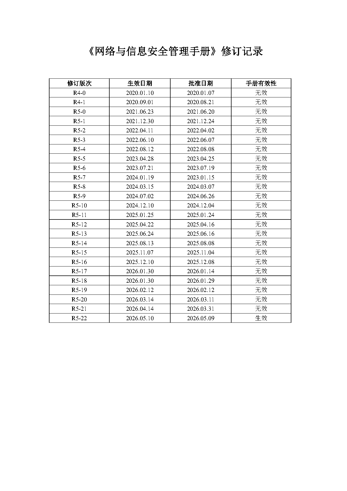
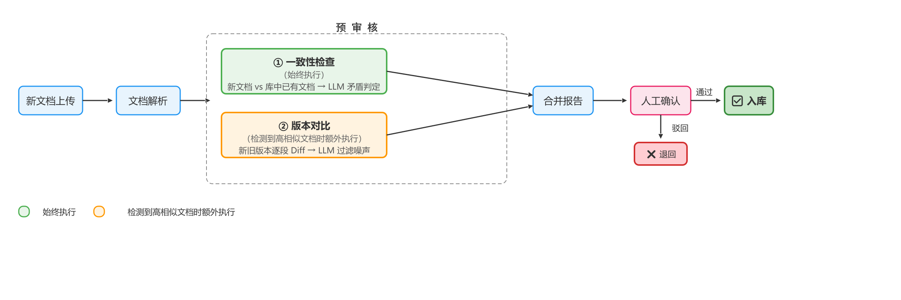
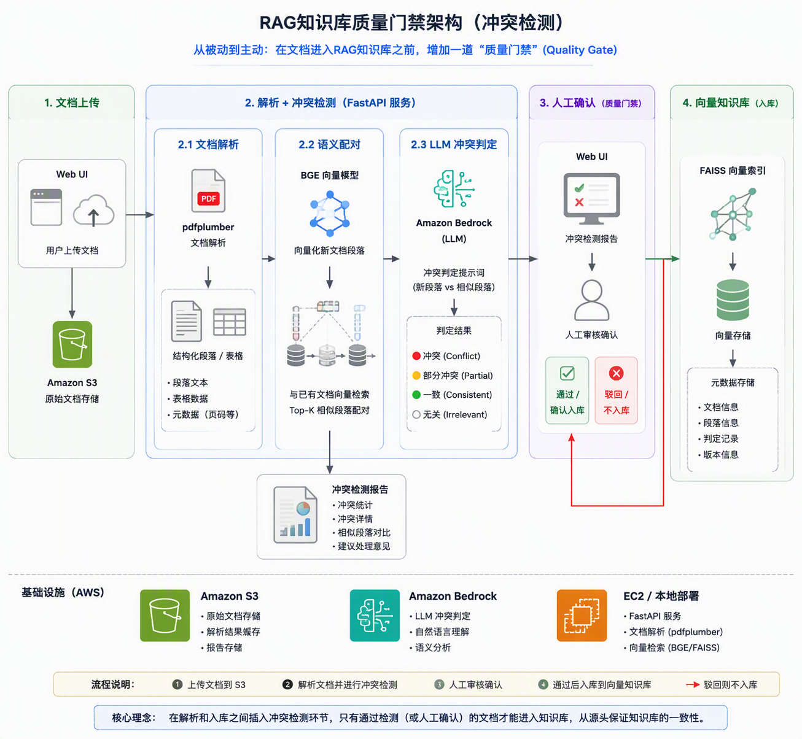
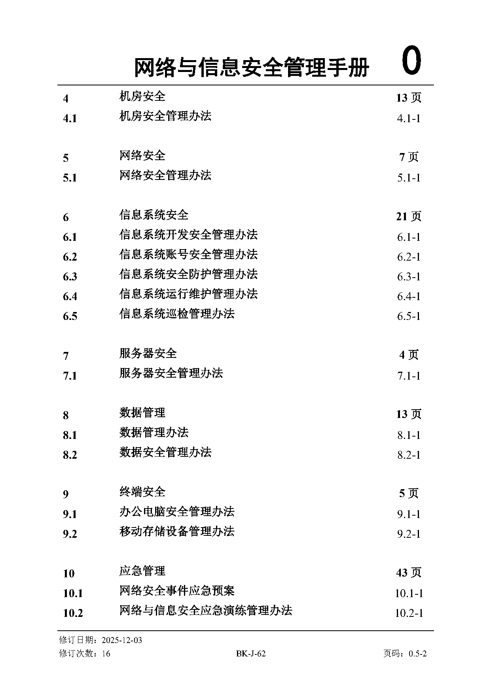
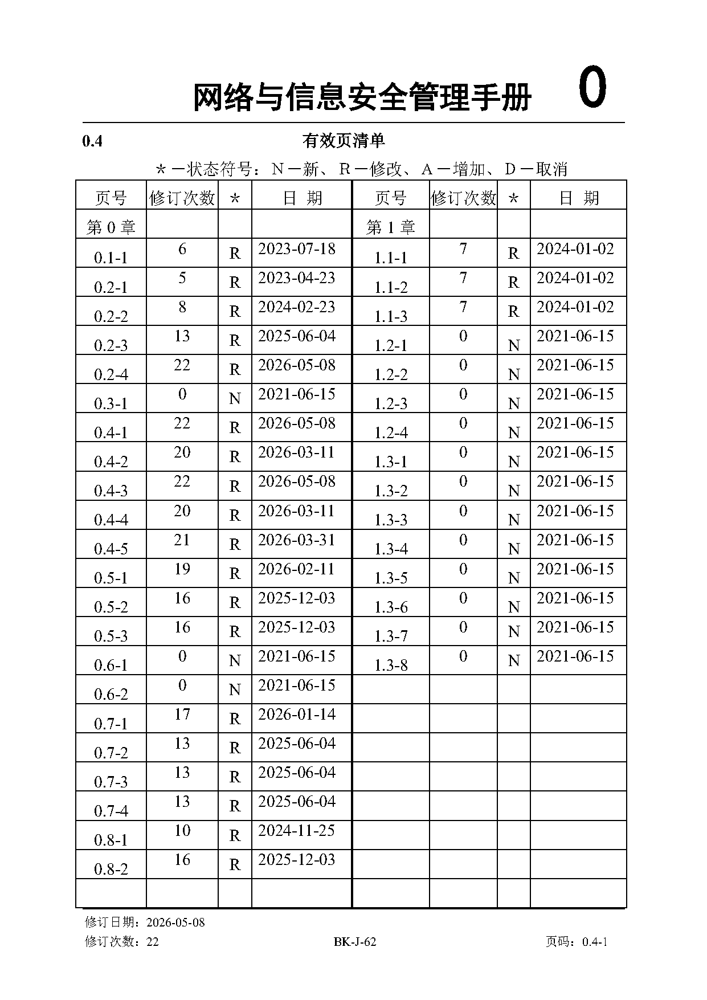

# 民航规章手册版本差异自动识别——为企业 RAG 知识库构建 LLM 入库质量门禁

民航企业的规章制度天然就是"多级别 × 多版本"的——二级手册定原则、三级手册抓执行、部门规范管细节，每份手册又每隔几个月就修订一版。当这些文档被一股脑灌进 RAG 知识库时，会发生什么？

标准的 RAG 系统对"入库"这件事的态度很简单粗暴：文档来了，切块，向量化，写入向量库，结束。**它不关心新进来的内容和库里已有的内容是否矛盾，也不关心你上传的是第几个版本、跟上一版到底改了什么。** 一切"质量问题"都被推迟到用户提问的那一刻——如果用户恰好问到一个两份文档说法不一致的问题，LLM 要么任选一个（可能选错），要么给出一个模棱两可的回答（"根据文档A是这样，但文档B又说那样"）。在民航这种对规章一致性要求极高的行业，这是不可接受的。

本文介绍我们为某民航企业构建的一套"入库预审核"机制——不是等用户问到时才发现问题，而是**在文档进入知识库的那一刻就把矛盾拦住**。

---

## 背景：民航手册体系的复杂性

以某民航企业为例，IT 与信息安全领域的管理制度按批准权限分层：

| 级别  | 批准人    | 定位         | 示例               |
| --- | ------ | ---------- | ---------------- |
| 二级  | 公司分管领导 | 全公司层面的管理制度 | 信息安全管理手册、IT 管理手册 |
| 三级  | 部门负责人  | 部门内部的执行程序  | 部门工作手册、作业指导书     |
| 四级  | 处室/岗位  | 具体操作规范     | 运维操作规范、巡检作业指导    |

每一级手册都白纸黑字写着"不得与上一层级手册相冲突"。理论上很美好——但实际情况是，某二级手册从初版到当前已经修订了 20 多次，每次改几十页。负责修订的同事不一定清楚三级手册里引用了自己的哪一段、另一份二级手册对同一个事项是怎么描述的。时间一长，矛盾就可能悄悄出现。



*图1：某二级手册的修订记录表。从 v1.0 到当前版本已迭代 20 余次，每次修订涉及数十页变更。当这些版本同时存在于知识库中时，用户检索到的内容可能来自不同版本。*

更现实的问题是：**每次修订后，手册管理员需要人工逐页比对新旧版本，写出一份《修订说明及内容对比清单》。** 这份清单通常十几页，全靠人肉 diff——费时费力，还容易漏掉细微但关键的改动。

---

## 我们的方案：入库预审核

我们的核心思路是：**在文档正式写入 RAG 知识库之前，加一道"预审核"（Quality Gate）。** 不是用户问了才发现问题，而是入库时就主动发现。

具体来说，每次新文档上传时，系统**同时执行两项检查**：



*图2：入库预审核流程。绿色框（一致性检查）每次入库始终执行，橙色框（版本对比）在检测到同名旧版本时额外执行，两项结果合并为一份预审核报告供人工确认。*



*图3：入库预审核系统整体架构。包含文档解析、语义配对、LLM 判定三个核心组件，部署在 AWS EC2 上运行 FastAPI 服务。*

为什么是"同时执行"而不是"二选一"？因为你改了二级手册的某一段话，这段话的新版本不仅和旧版本不一样（版本差异），还有可能和三级手册里引用的描述产生了矛盾（一致性问题）。两件事必须一起查。

**具体流程**：

1. 新文档上传时，系统先检查知识库中有没有同名文件。有的话，提示用户选"覆盖旧版"或"作为新版本并存"，并记下旧版文件路径。

2. **一致性检查**（每次入库都跑）：把新文档的每段话拿去和库里所有已有文档做语义配对。找到"说的是同一件事但描述不一样"的段落对，交给 LLM 判断是真矛盾还是只是措辞不同。这是底线安全网——无论你上传的是新文档还是旧文档的新版本，这一步都不能跳过。

3. **版本对比**（有旧版本时额外执行）：如果库中存在同名旧文档，系统额外做一次新旧版本的逐段 diff——按章节号对齐，找出所有新增、删除、修改的段落，再由 LLM 过滤掉"只是编号变了""只是措辞微调"这种非实质性变更，留下真正改了内容的部分。

4. 两项检查的结果**合并成一份预审核报告**呈现给管理员——有矛盾就列出来，有版本差异就列出来。人工确认没问题了，文档才正式入库。

---

## 文档解析：搞定民航 PDF 的"奇葩"排版

你可能觉得"PDF 解析"这事早就被各种开源库解决了。但民航管理手册的排版有几个让人头疼的特点：

| 排版特征    | 它长什么样                                 | 为什么烦人                                |
| ------- | ------------------------------------- | ------------------------------------ |
| 左侧编号列   | 章节编号（1.1、1.1.2）排在页面最左边，正文在右侧          | pdfplumber 按坐标聚行时，编号和正文混在一起，分不清哪个是哪个 |
| 跨页表格    | 一张大表格跨 2-3 页，续页可能重复表头                 | 被自动拆成 2-3 个独立表格，丢失整体性                |
| 页眉页脚元数据 | 每页底部都有"修订日期：2024-01-02 文件编号 页码：1.1-1" | 和正文只差几个像素，经常被当成正文的一部分                |



*图3：手册目录页的实际排版。注意左侧 margin 区域的章节编号（4/4.1/5/5.1/6/6.1…）与右侧标题文字的空间分离——这是 PDF 解析的主要挑战之一。*



*图4：手册中的结构化表格（有效页清单）。这类密集表格跨页时会被自动拆分，需要合并处理才能保持完整性。*

我们的做法是**配置化**——不硬编码处理逻辑，而是通过 YAML 配置适配不同文档的排版特征。核心技巧是"**左 margin 编号列自动分离**"：给定一个 x 坐标阈值（比如 130pt），在这条线左边且匹配章节编号正则的文字，一律视为编号，固定到行首。

```yaml
extract:
  margin_number_x: 130
  margin_number_pattern: '^(?:\d+(?:\.\d+)*|[A-Z])$'
  table_empty_cell_threshold: 0.6
```

效果：章节识别准确率从约 50% 提升到 95% 以上。14 处跨页表格自动合并，17 个空白模板表格（签到表、申请表）自动过滤不入库。一份 179 页的手册，端到端解析 < 5 秒。

---

## 语义配对与冲突检测

解析完成后，每个段落都有了结构化的文本和位置信息。接下来要回答的问题是：**新文档里的这段话，和库里哪些段落在说同一件事？说法一样吗？**

### 第一步：向量检索找"候选对"

用 BGE（BAAI/bge-small-zh-v1.5）对每个段落做 Embedding，通过 FAISS 索引快速检索与新文档段落语义相似的已有段落：

```python
similar_pairs = []
for para in new_doc_paragraphs:
    vec = embed_model.encode(para.text)
    distances, indices = faiss_index.search(vec, k=5)
    for dist, idx in zip(distances[0], indices[0]):
        if dist < similarity_threshold:
            similar_pairs.append((para, existing_paragraphs[idx]))
```

相似度阈值设为 0.80——太低会召回大量无关段落浪费 LLM 调用，太高又会漏掉真正的矛盾对。

### 第二步：LLM 判定是否矛盾

找到"说的像是同一件事"的段落对后，下一步交给 LLM 判断——到底是真矛盾，还是只是换了个说法？

我们设计了一套分类体系：

| 类别              | 含义                  | 系统怎么处理          |
| --------------- | ------------------- | --------------- |
| `inconsistency` | 对同一事项的描述确实矛盾        | **阻断入库**，必须人工确认 |
| `substantive`   | 有实质性变更（数值、流程、责任人变了） | 提醒确认            |
| `refinement`    | 下级文档合理细化了上级规定       | 标记关系，正常入库       |
| `numbering`     | 只是编号/格式变了           | 自动放行            |
| `metadata`      | 只是修订日期等元数据变了        | 自动放行            |

LLM 调用通过 Amazon Bedrock Converse API：

```python
def judge_differences(diff_pairs, model_id="zai.glm-4.7-flash"):
    client = boto3.client("bedrock-runtime", region_name="us-east-1")
    results = []
    for pair in diff_pairs:
        response = client.converse(
            modelId=model_id, messages=[{"role": "user", "content": [{"text": prompt}]}]
        )
        results.append(parse_classification(response))
    return results
```

这里有个关键设计：**规则预过滤 + LLM 判定的两级策略**。大量"修订日期变了""编号重排了"的差异，用正则就能识别，根本不用浪费 LLM 调用。只有规则拿不准的，才送给 LLM 判断。实测下来，规则层能过滤掉 30%~50% 的候选对，大幅降低 LLM 成本。

---

## AWS 部署架构

| 组件     | AWS 服务          | 说明                              |
| ------ | --------------- | ------------------------------- |
| 文档存储   | Amazon S3       | 原始 PDF/DOCX 存储，支持版本控制           |
| LLM 推理 | Amazon Bedrock  | 调用 GLM-4.7-flash（东京/美国区域）进行差异判定 |
| 应用服务   | EC2 / ECS       | 运行 FastAPI + 文档解析 + FAISS       |
| 向量模型   | 本地 GPU 实例       | BGE 模型推理                        |
| 前端     | S3 + CloudFront | 静态 SPA 页面                       |

**中国区域怎么办？** Amazon Bedrock 在中国区不可用。我们的替代方案是 **EC2 G5 实例 + llama.cpp 自建 LLM**：跑 GLM-4.7-flash 的 Q4-K-M 量化版，2 路并发 × 80K 上下文窗口。对外暴露 OpenAI-compatible API，业务代码只需改一行 `base_url` 配置，零代码改动。

---

## 效果

拿某民航企业 179 页的信息安全管理手册实测：

| 指标       | 数值     |
| -------- | ------ |
| 文档页数     | 179 页  |
| 提取段落数    | ~320 段 |
| 跨页表格自动合并 | 14 处   |
| 空白模板表格过滤 | 17 个   |
| 端到端解析耗时  | < 5 秒  |

### 版本对比效果

对同一手册前后两个版本做对比，系统自动输出差异清单。举个实际例子：

> **旧版** §10.4.2.3："若 UPS 电量消耗较快时，可关闭非关键设备"
> 
> **新版** §10.4.2.3："若预计的恢复时间较长，或 UPS 电量消耗较快时，可关闭非关键设备（如非必要运行的服务器、机房测试设备等），确保重要设备正常供电（如核心交换机、防火墙、各专线路由器以及重要系统的服务器等）"

系统判定为 `substantive`（实质性变更）：新版增加了触发条件（"预计恢复时间较长"）和具体设备清单。这份差异清单可以直接作为《手册修订说明及内容对比清单》的初稿，大幅减少手册管理员的工作量。

### 一致性检查效果

新文档入库时，系统自动与库中已有文档配对。例如：

> **二级手册** §2.3.10.1："考核80分以上为合格，补考不及格者不得参加岗位工作"
> 
> **三级手册** §3.7.5.2："考核80分合格...可在 **1个月内** 申请补考一次"

系统判定为 `refinement`（合理细化）：三级手册增加了补考的时间窗口约束（1个月内），但没有违反上级的 80 分合格线规定。这种情况标记为细化关系，正常入库。

### 有无预审核的对比

|       | 没有预审核                  | 有预审核                 |
| ----- | ---------------------- | -------------------- |
| 版本差异  | 手册管理员人工逐页比对，写对比清单（几小时） | 系统 30 秒自动生成，人工审核确认即可 |
| 文档间矛盾 | 用户问到时才发现，LLM 给出矛盾回答    | 入库时主动拦截，知识库始终一致      |
| 合规审计  | 手写记录，容易遗漏              | 机器生成检测报告，可直接作为审计证据   |

---

## 适用场景

| 检查项       | 什么时候触发        | 解决什么问题                   | 多久跑一次  |
| --------- | ------------- | ------------------------ | ------ |
| **一致性检查** | 每次新文档入库（始终执行） | 入库底线安全网：确保新文档不和已有知识库内容打架 | 每次入库   |
| **版本对比**  | 库中已有同名旧版文档时   | 自动生成修订对比清单，替代人工逐页 diff   | 每次版本更新 |

两项检查并行执行，结果合并为一份预审核报告。人工确认无误后，文档方可入库。

---

**作者介绍**

申洪汭，西云数据（NWCD）快速原型解决方案架构师，专注于AI应用领域。
